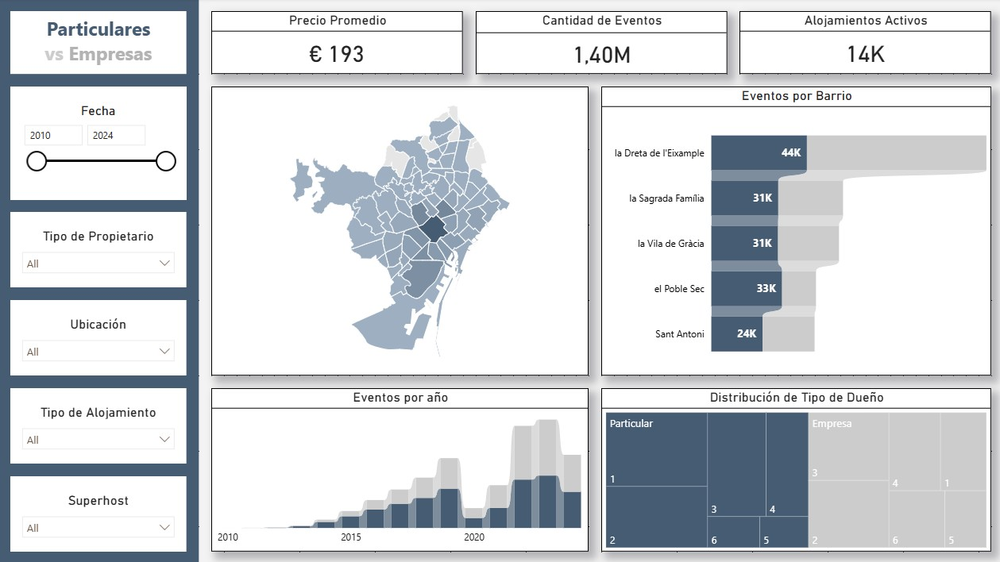
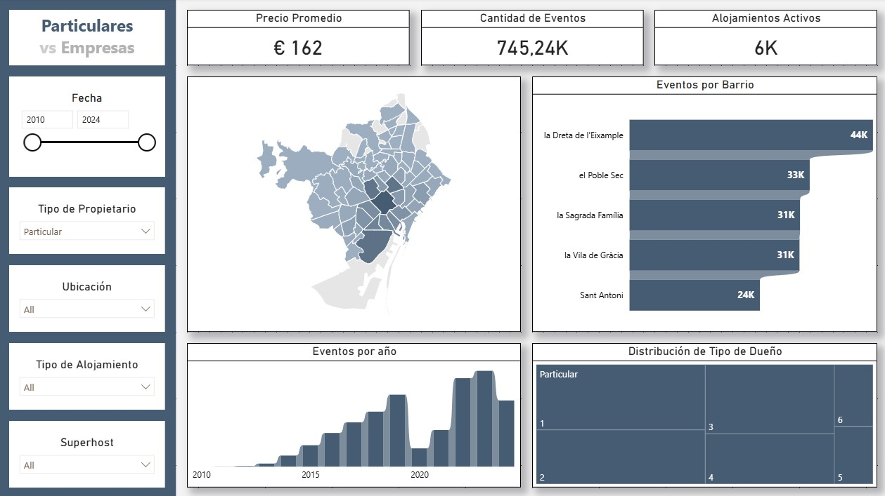
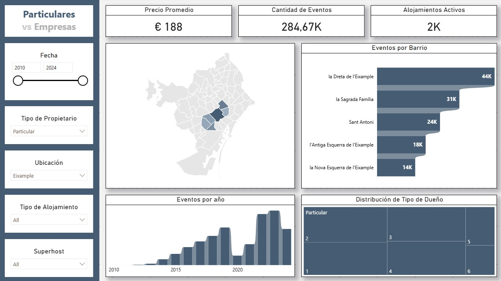
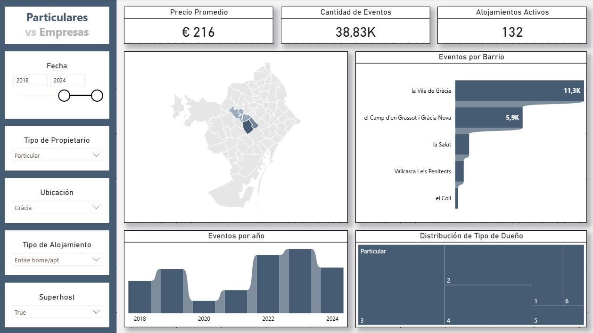

# 🏙️ Airbnb Barcelona — Dashboard de Análisis para Empresa de Servicios de Hospedaje

> **Caso de uso simulado:** Análisis de datos de Airbnb en Barcelona para una empresa que evalúa lanzar un servicio de **lockers para valijas y gestión de llaves**, orientado a propietarios de alojamientos particulares.


---

## 📥 Descargar Dashboard

[⬇️ Descargar archivo .pbix](https://drive.google.com/file/d/19q4IImJJBKNBNIq_jgLnFp2WG3bWV_sX/view?usp=drive_link)

---

## 📌 Contexto del Negocio

Una empresa de servicios busca expandirse en Barcelona ofreciendo:
- **Almacenamiento de equipaje** (lockers para huéspedes)
- **Gestión de llaves / check-in remoto** para propietarios

Para definir su estrategia comercial, necesita entender:
- Qué tan activos son los alojamientos (rotación y eventos)
- Cuántos huéspedes manejan (proxy de capacidad de almacenaje)
- Si el propietario es un **particular** (público objetivo principal) o una **empresa/gestor profesional** (potencial aliado estratégico)
- El precio promedio de alquiler, para decidir entre un modelo de **comisión porcentual** o **tarifa fija**

---

## 📊 Dashboard

### KPIs Principales

| KPI | Valor |
|---|---|
| 💰 Precio Promedio | € 193 |
| 📅 Cantidad de Eventos | 1,40M |
| 🏠 Alojamientos Activos | 14K |

### Vistas del Dashboard

| Vista completa | Filtro: Particulares |
|---|---|
|  |  |

| Filtro: Barrio | Todos los filtros |
|---|---|
|  |  |

### Visualizaciones incluidas

- **Mapa de Barcelona** — distribución geográfica de alojamientos por barrio
- **Eventos por Barrio** — ranking de actividad: los 5 barrios con mayor rotación
- **Eventos por Año** — serie temporal 2010–2024: crecimiento sostenido de la plataforma
- **Distribución de Tipo de Dueño** — segmentación Particular vs. Empresa por tipo de alojamiento

### Filtros disponibles

| Filtro | Descripción |
|---|---|
| 📆 Fecha | Rango temporal 2010–2024 |
| 👤 Tipo de Propietario | Particular / Empresa / Todos |
| 📍 Ubicación | Filtro por barrio |
| 🏡 Tipo de Alojamiento | Casa entera / Habitación privada / Compartida |
| ⭐ Superhost | Sí / No / Todos |

> **Nota sobre el filtro Superhost:** Permite identificar propietarios *no-superhost*, que son el segmento con mayor potencial de mejora de servicio y, por tanto, los más receptivos a una propuesta de valor externa.

---

## 🎨 Decisiones de Diseño

El dashboard fue diseñado para **minimizar el ruido visual** y maximizar la claridad:

- **Paleta bicolor:** Azul oscuro para **Particulares** (público objetivo) — Gris claro para **Empresas** (aliados potenciales). El código de colores se explica *una sola vez* en el título del dashboard (`Particulares vs Empresas`), evitando redundancia de leyendas.
- **Valores visibles donde importan:** Los eventos por barrio incluyen etiquetas de datos porque el *volumen exacto* es relevante para la toma de decisiones. La serie temporal *no* las incluye porque allí el foco es la tendencia de crecimiento, no el número puntual.
- **Fondo y elementos neutros en gris claro:** Reducen la carga cognitiva y dirigen la atención a los datos.

---

## 🧱 Metodología y Modelo de Datos

### Clasificación de Tipo de Propietario

```
SI un mismo host_id tiene más de 5 listings → se clasifica como "Empresa"
EN CASO CONTRARIO → se clasifica como "Particular"
```

Las empresas aparecen en gris en el dashboard porque no son el público objetivo directo del servicio de lockers, pero se mantienen visibles como **potenciales socios estratégicos** (B2B).

### Estructura del Modelo

```
📁 Modelo de Datos Power BI
│
├── Tabla: listings          ← datos base de alojamientos
├── Tabla: calendar          ← disponibilidad y reservas
├── Tabla: reviews           ← actividad y eventos
├── Tabla: neighbourhoods    ← barrios
│
├── Tabla: Date              ← tabla de fechas creada manualmente
│   └── Relacionada con calendar[date] y reviews[date]
│
└── Tabla: _Medidas          ← tabla dedicada exclusivamente a métricas DAX
    ├── Precio Promedio
    ├── Cantidad de Eventos
    ├── Alojamientos Activos
    └── [otras métricas]
```

> La separación de medidas en una tabla propia (`_Medidas`) es una **buena práctica de desarrollo en Power BI**: facilita el mantenimiento, mejora la legibilidad del modelo y evita mezclar lógica de negocio con datos crudos.

---

## 🗂️ Estructura del Repositorio

```
bcn-airbnb-locker-market-analysis/
│
├── README.md
│
└── assets/
    ├── dashcompleto.jpg        ← vista general sin filtros
    ├── dashparticular.jpg      ← filtrado: solo particulares
    ├── dashbarrio.jpg          ← filtrado: por barrio
    └── dashallfilters.jpg      ← todos los filtros aplicados
```

> El archivo `.pbix` está disponible para descarga en Google Drive (ver link al inicio).

---

## 📦 Fuente de Datos

**Inside Airbnb** — [insideairbnb.com](http://insideairbnb.com)

> Inside Airbnb es un proyecto independiente que recopila y analiza datos públicos de Airbnb. Los datos utilizados corresponden a la ciudad de **Barcelona, España**.

Los archivos originales (`listings.csv`, `calendar.csv`, `reviews.csv`) no se incluyen en este repositorio por su tamaño. Pueden descargarse directamente desde el sitio de Inside Airbnb filtrando por Barcelona.

---

## 🛠️ Herramientas

- **Power BI Desktop** — modelado de datos, DAX y visualización
- **Inside Airbnb** — fuente de datos abierta

---

## 👤 Autor

**[Tu Nombre]**  
[LinkedIn](https://linkedin.com/in/tu-perfil) · [Portfolio](https://tu-portfolio.com)
