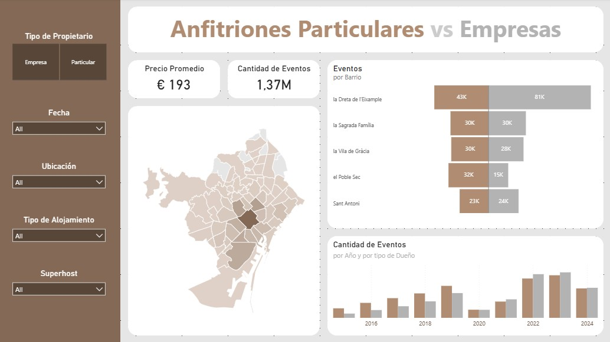
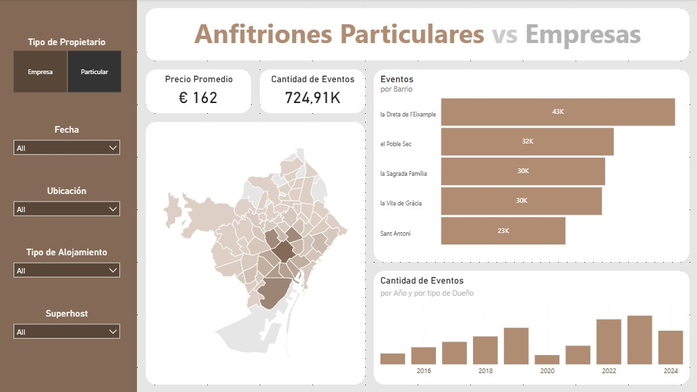
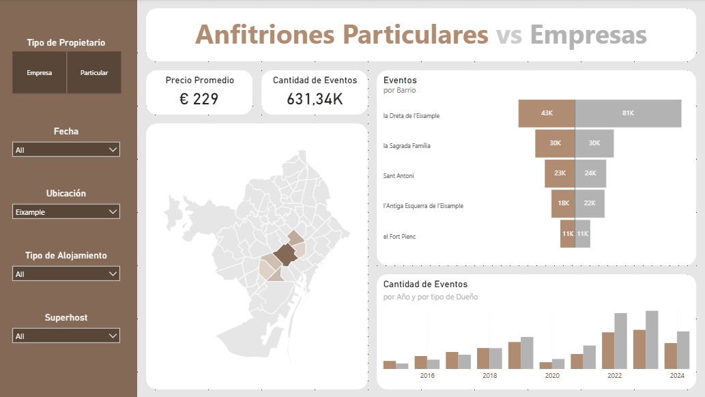
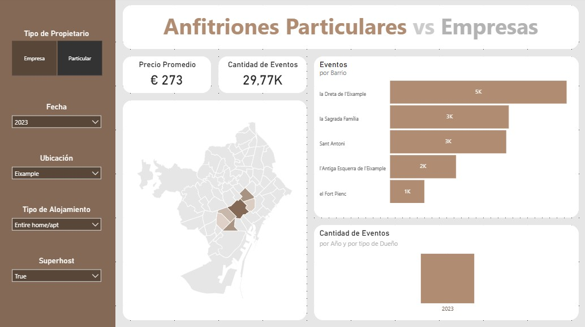

# 🏙️ Airbnb Barcelona — Dashboard de Análisis para Empresa de Servicios de Hospedaje

> **Caso de uso simulado:** Análisis de datos de Airbnb en Barcelona para una empresa que evalúa lanzar un servicio de **lockers para valijas y gestión de llaves**, orientado a propietarios de alojamientos particulares.




---

## 📥 Descargar Dashboard

| Versión | Link |
|---|---|
| 🔵 Azul | [⬇️ Descargar .pbix](https://drive.google.com/file/d/19q4IImJJBKNBNIq_jgLnFp2WG3bWV_sX/view?usp=drive_link) |
| 🟤 Beige | [⬇️ Descargar .pbix](https://drive.google.com/file/d/1gv8Q4cmvVVqBIlhXjBoonh4J6V3XlGId/view?usp=drive_link) |

---

## 📌 Contexto del Negocio

Una empresa de servicios busca expandirse en Barcelona ofreciendo:
- **Almacenamiento de equipaje** (lockers para huéspedes)
- **Gestión de llaves / check-in remoto** para propietarios

Para definir su estrategia comercial, necesita entender:
- Qué tan activos son los alojamientos (rotación y eventos)
- Cuántos huéspedes manejan (proxy de capacidad de almacenaje)
- Si el propietario es un **particular** (público objetivo principal) o una **empresa/gestor profesional** (potencial aliado estratégico)
- El precio promedio de alquiler, para decidir entre un modelo de **comisión porcentual** o **tarifa fija**

---

## 📊 Dashboard

### KPIs Principales

| KPI | Valor |
|---|---|
| 💰 Precio Promedio | € 193 |
| 📅 Cantidad de Eventos | 1,40M |
| 🏠 Alojamientos Activos | 14K |

---

## 🎨 Dos versiones de diseño

El mismo dashboard fue desarrollado en dos paletas de color distintas, manteniendo idéntica la lógica y estructura de información. Ambas respetan el mismo principio: **el color primario identifica a los Particulares** (público objetivo) y el **gris/neutro a las Empresas** (aliados potenciales), codificado una sola vez en el título para evitar redundancia de leyendas.

### Versión Azul

| Vista completa | Filtro: Particulares |
|---|---|
|  |  |

| Filtro: Barrio | Todos los filtros |
|---|---|
|  |  |

### Versión Beige

| Vista completa | Filtro: Particulares |
|---|---|
|  |  |

| Filtro: Barrio | Todos los filtros |
|---|---|
|  |  |

---

## 🖌️ Decisiones de Diseño

El dashboard fue diseñado para **minimizar el ruido visual** y maximizar la claridad:

- **Paleta bicolor:** El color primario (azul en v1, beige en v2) identifica a los **Particulares**; el gris claro a las **Empresas**. El código se explica *una sola vez* en el título, evitando repetir leyendas en cada gráfico.
- **Valores visibles donde importan:** Los eventos por barrio incluyen etiquetas de datos porque el *volumen exacto* es relevante para la toma de decisiones. La serie temporal no las incluye porque el foco allí es la tendencia de crecimiento.
- **Elementos neutros en segundo plano:** El fondo y los elementos decorativos en gris claro reducen la carga cognitiva y dirigen la atención a los datos.

### Visualizaciones incluidas

- **Mapa de Barcelona** — distribución geográfica de alojamientos por barrio
- **Eventos por Barrio** — ranking de actividad: los 5 barrios con mayor rotación
- **Eventos por Año** — serie temporal 2010–2024: crecimiento sostenido de la plataforma
- **Distribución de Tipo de Dueño** — segmentación Particular vs. Empresa por tipo de alojamiento

### Filtros disponibles

| Filtro | Descripción |
|---|---|
| 👤 Tipo de Propietario | Particular / Empresa / Todos |
| 📆 Fecha | Rango temporal |
| 📍 Ubicación | Filtro por barrio |
| 🏡 Tipo de Alojamiento | Casa entera / Habitación privada / Compartida |
| ⭐ Superhost | Sí / No / Todos |

> **Nota sobre el filtro Superhost:** Permite identificar propietarios *no-superhost*, el segmento con mayor potencial de mejora y más receptivo a una propuesta de valor externa.

---

## 🧱 Metodología y Modelo de Datos

### Clasificación de Tipo de Propietario

```
SI un mismo host_id tiene más de 5 listings → se clasifica como "Empresa"
EN CASO CONTRARIO → se clasifica como "Particular"
```

Las empresas se mantienen visibles en el dashboard como **potenciales socios estratégicos** (B2B).

### Estructura del Modelo

```
📁 Modelo de Datos Power BI
│
├── Tabla: listings          ← datos base de alojamientos
├── Tabla: calendar          ← disponibilidad y reservas
├── Tabla: reviews           ← actividad y eventos
├── Tabla: neighbourhoods    ← actividad y eventos
│
├── Tabla: Date              ← tabla de fechas creada manualmente
│   └── Relacionada con calendar[date] y reviews[date]
│
└── Tabla: _Medidas          ← tabla dedicada exclusivamente a métricas DAX
    ├── Precio Promedio
    ├── Cantidad de Eventos
    └── Alojamientos Activos
```

> La separación de medidas en una tabla propia (`_Medidas`) es una **buena práctica en Power BI**: facilita el mantenimiento y evita mezclar lógica de negocio con datos crudos.

---

## 🗂️ Estructura del Repositorio

```
bcn-airbnb-locker-market-analysis/
│
├── README.md
│
└── assets/
    ├── dashcompleto.jpg           ← v. azul: sin filtros
    ├── dashparticular.jpg         ← v. azul: solo particulares
    ├── dashbarrio.jpg             ← v. azul: filtro barrio
    ├── dashallfilters.jpg         ← v. azul: todos los filtros
    ├── dashcompleto_beige.jpg     ← v. beige: sin filtros
    ├── dashparticular_beige.jpg   ← v. beige: solo particulares
    ├── dashbarrio_beige.jpg       ← v. beige: filtro barrio
    └── dashallfilters_beige.jpg   ← v. beige: todos los filtros
```

> El archivo `.pbix` está disponible para descarga en Google Drive (ver link al inicio).

---

## 📦 Fuente de Datos

**Inside Airbnb** — [insideairbnb.com](http://insideairbnb.com)

Los archivos originales (`listings.csv`, `calendar.csv`, `reviews.csv`) no se incluyen por su tamaño. Pueden descargarse desde el sitio de Inside Airbnb filtrando por Barcelona.

---

## 🛠️ Herramientas

- **Power BI Desktop** — modelado de datos, DAX y visualización
- **Inside Airbnb** — fuente de datos abierta

---

## 👤 Autor

**Emilio Echagüe**  
[LinkedIn](https://www.linkedin.com/in/emilioechague)
